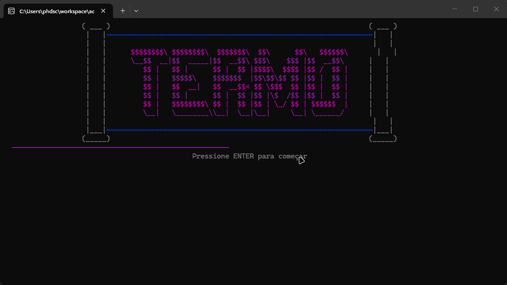

# 🎯 Jogo Termo (C# Console)



Um jogo inspirado no clássico **Termo / Wordle**, desenvolvido em **C#**
com foco em **lógica de programação, validação de entradas, manipulação
de strings e experiência visual no console**.

O projeto simula a mecânica de descoberta de palavras com feedback
visual por cores, utilizando uma estrutura organizada em métodos e
separação de responsabilidades.

------------------------------------------------------------------------

## 🚀 Funcionalidades

🔹 Sorteio aleatório de palavras\
🔹 Sistema de até **5 tentativas**\
🔹 Feedback visual por letra: - 🟩 **VERDE** → letra correta na posição
correta - 🟨 **AMARELO** → letra existe na palavra, mas em outra
posição - 🟥 **VERMELHO** → letra não está na palavra

🔹 Bloqueio de palavras repetidas\
🔹 Validação completa de entradas\
🔹 Sistema de reinício de partida\
🔹 Interface visual estilizada no terminal\
🔹 Estrutura modular com classes: - `Game` - `Display` - `WordService`

------------------------------------------------------------------------

## 🎮 Como funciona

1.  O jogo sorteia uma palavra secreta
2.  O jogador possui até **5 tentativas**
3.  A cada tentativa:
    -   a palavra é validada
    -   a grade é atualizada
    -   cada letra recebe sua cor
4.  O jogador vence ao acertar a palavra
5.  Ao final, pode escolher jogar novamente

------------------------------------------------------------------------

## 🧠 Exemplo de execução

``` text
🎯 TERMO

Tentativa 1 de 5

┌───┐ ┌───┐ ┌───┐ ┌───┐ ┌───┐
│ C │ │ A │ │ S │ │ A │ │ L │
└───┘ └───┘ └───┘ └───┘ └───┘

█ Posição certa
█ Letra existe
█ Não está

Digite uma palavra:
```

------------------------------------------------------------------------

## 🛠️ Tecnologias utilizadas

-   C#
-   .NET
-   Console Application
-   `RandomNumberGenerator`
-   Programação orientada a métodos
-   Manipulação de listas e arrays
-   Console UI personalizada

------------------------------------------------------------------------

## 📌 Conceitos aplicados

-   Estruturas condicionais (`if`)
-   Estruturas de repetição (`while`, `for`)
-   Manipulação de strings
-   Arrays (`string[]`, `bool[]`)
-   Listas (`List<string>`)
-   Validação de entrada
-   Controle de fluxo
-   Separação de responsabilidades
-   UI em console
-   Lógica de comparação de letras

------------------------------------------------------------------------

## 🧱 Estrutura do projeto

``` text
JogoTermo
 ┣ 📂 docs
 ┃ ┗ 📄 WindowsTerminal_TN56IACyGW.gif
 ┣ 📂 JogoTermo.ConsoleApp
 ┃ ┣ 📄 Program.cs
 ┃ ┣ 📄 Game.cs
 ┃ ┣ 📄 Display.cs
 ┃ ┗ 📄 WordService.cs
 ┗ 📄 README.md
```

------------------------------------------------------------------------

## ▶️ Como executar

``` bash
# Clone o repositório
git clone https://github.com/seu-usuario/termo-game.git

# Acesse a pasta
cd termo-game

# Execute o projeto
dotnet run
```

------------------------------------------------------------------------

## 📈 Possíveis melhorias

-   Banco maior de palavras
-   Níveis de dificuldade
-   Ranking local
-   Persistência em JSON
-   Histórico de partidas
-   Tema claro/escuro
-   Modo competitivo
-   Multiplayer local
-   Versão com interface gráfica (WPF)

------------------------------------------------------------------------

## 👨‍💻 Autor

**Pedro Henrique dos Santos**\
🚀 Desenvolvedor focado em evolução constante com **C# e .NET**
