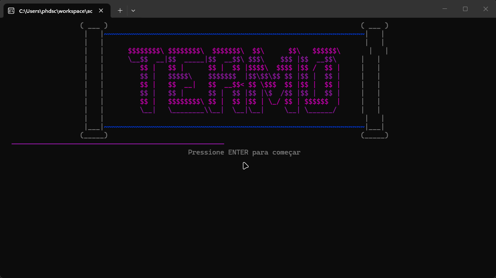

# 🎯 Jogo Termo (C# Console)



Um jogo inspirado no famoso **Termo / Wordle**, desenvolvido em **C#** no console com foco em **lógica de programação, manipulação de strings, validação de entradas e organização em métodos**.

O projeto foi criado para praticar conceitos fundamentais de desenvolvimento backend com **C# e .NET**, simulando a mecânica clássica de descoberta de palavras com feedback por letras.

---

## 🚀 Funcionalidades

🔹 Sorteio aleatório de palavras  
🔹 Sistema de até **5 tentativas**  
🔹 Validação completa de entradas  
🔹 Bloqueio de palavras repetidas  
🔹 Feedback por letra:
- 🟩 **VERDE** → letra correta na posição correta
- 🟨 **AMARELO** → letra existe na palavra, mas em outra posição
- 🟥 **VERMELHO** → letra não existe na palavra

🔹 Controle de continuação da partida  
🔹 Estrutura modular com métodos  
🔹 Exibição visual personalizada no console  

---

## 🎮 Como funciona

1. O jogo sorteia uma palavra secreta de 5 letras  
2. O jogador digita uma tentativa  
3. O sistema valida:
- tamanho da palavra
- apenas letras
- palavras já utilizadas
- entrada vazia

4. O jogo retorna o status de cada letra:
- posição correta
- letra existente
- letra ausente

5. O jogador possui até **5 chances**
6. Ao final, pode escolher jogar novamente

---

## 🧠 Exemplo de execução

```text
=== TERMO ===

Digite ENTER para dar início

Digite uma palavra:
CASAL

C -> VERDE
A -> VERDE
S -> AMARELO
A -> VERMELHO
L -> VERMELHO

Digite uma palavra:
CASAS

Acertou em 2 tentativa(s)!

Deseja continuar? (S/N):